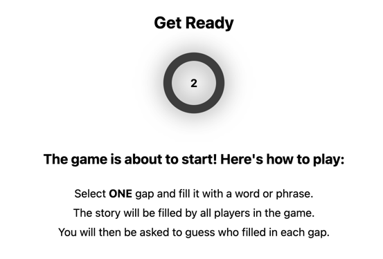

# Blank vs humanity (Word Weaver Backend)

[](https://github.com/2er0/WordWeaverUI)
[](https://github.com/2er0/WordWeaver)

It's a game where you can challenge your friends to see who is the most creative and can you figure out who completed
the blank spaces of a sentence with the funny and creative answers.

| Fill in the blank            | Get ready                              |
|------------------------------|----------------------------------------|
|  |  |

---

## How to play

1. Create a new game
2. Create a lobby -> GameId
3. Share the GameId with your friends
4. Wait for your friends to join the lobby
5. Start the game
6. Complete the blank spaces with your creativity
7. Guess who completed the blank spaces
8. Have fun and see who knows everyone best

## Host your own server

```bash
# Clone the repository
# Build the docker image
docker compose build
# Run the docker container
docker compose up
```

Open your browser and go to `http://localhost:3000` to play the game.

Use `http://localhost:3000/swagger-ui` to see the API documentation and to set up new games.

### Structure for a new game

New games can be created by sending new game templates such as the one below to the server, which will be stored in the
database.
Each game template has a name and a list of text sections that will be used to create the game.
The UI creates for each new text entry in the list a new blank space except for the last one.

```json
{
  "name": "the office",
  "text_section": [
    "You sneak around the office and find",
    // Blank space 1
    ". Only to realize that",
    // Blank space 2
    "is the one who",
    // Blank space 3
    ". This is how you got to know the nickname of",
    // Blank space 4
    ". When ever you talk about it, something happens in the office."
  ]
}
```

---

## How to develop/contribute

### Prerequisites

- [Git](https://git-scm.com/downloads)
- [Rust](https://www.rust-lang.org/tools/install)
- [Docker](https://docs.docker.com/get-docker/)
- [Docker Compose](https://docs.docker.com/compose/install/)

### Run the database

```bash
docker compose up -d db
```

### Run the server

```bash
cargo run
```
